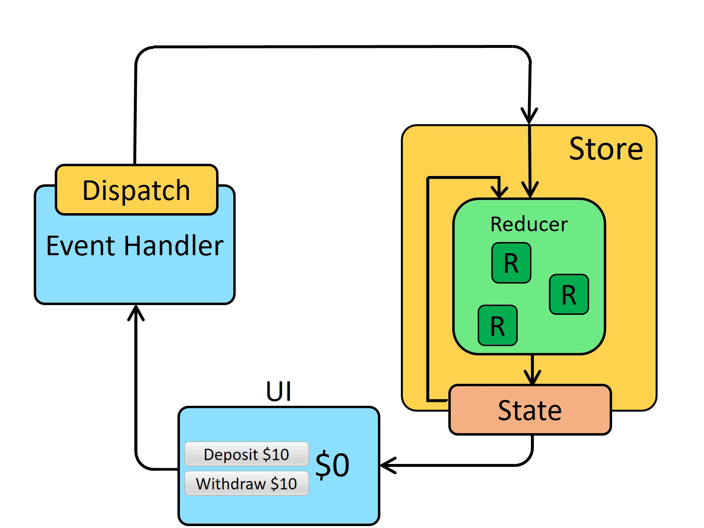

# Pet Care

## application architecture

### client-side

## redux & redux toolkit

- **Store:** Là nơi lưu trữ trạng thái của ứng dụng (app state). Store chỉ có thể được cập nhật thông qua việc dispatch một Action. Bất kỳ thành phần nào trong ứng dụng đều có thể truy cập vào Store để lấy dữ liệu hoặc theo dõi các thay đổi trạng thái.
- **Actions:** Là các đối tượng mô tả hành động mà ứng dụng muốn thực hiện. Mỗi Action thường có ít nhất một thuộc tính type (để xác định loại hành động) và có thể chứa các dữ liệu cần thiết để thay đổi trạng thái (payload). Actions giúp cho việc ghi lại và theo dõi các thay đổi trạng thái trong ứng dụng.
- **Reducers:** Là các hàm chịu trách nhiệm nhận Action và State hiện tại để trả về một State mới. Reducers không làm thay đổi State cũ mà chỉ tạo ra một State mới dựa trên State cũ và Action đã nhận. Chúng giúp đảm bảo rằng trạng thái ứng dụng luôn nhất quán và dễ kiểm soát.
